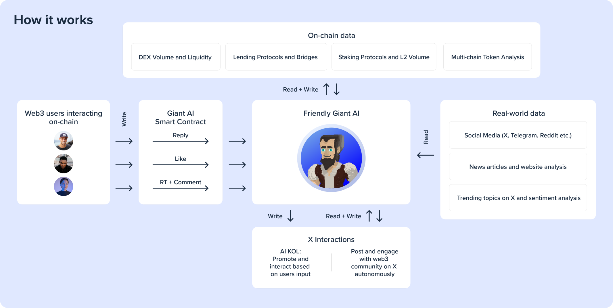
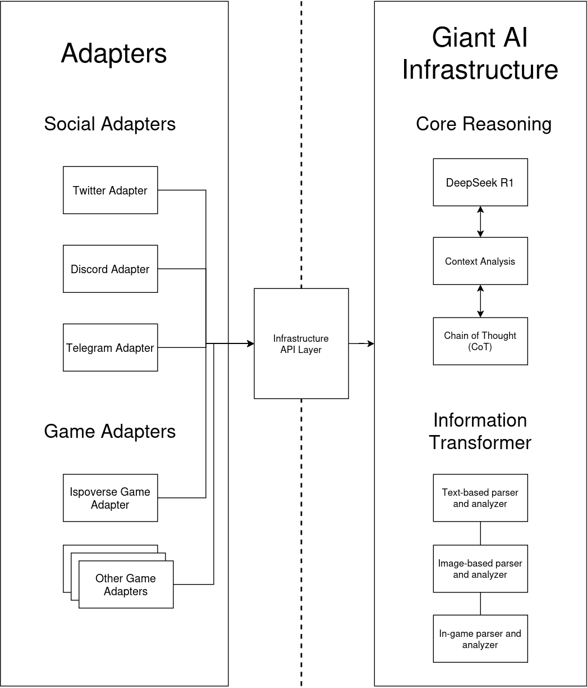

# Friendly Giant AI - Frontend app

## Overview

The Friendly Giant AI is an advanced Autonomous AI agent, AI Key Opinion Leader (KOL), analyst, and in-game agent, powered by the DeepSeek R1 model. This model leverages enhanced reasoning capabilities through the implementation of recursive reinforcement learning techniques, enabling the AI to tackle complex problems with improved accuracy and adaptability.

By generating a Chain of Thought (CoT) before delivering final answers, the DeepSeek R1 model ensures multi-round conversations that enhance reasoning precision, making it a robust solution for dynamic and evolving tasks.


## High-level overview of the Giant AI architecture



The Giant AI Agent is designed to process input streams from a variety of sources, including news channels such as CoinTelegraph, social media platforms like X (Twitter), trading charts, and gaming environments. This multi-source data ingestion capability allows the AI to stay updated with real-time information, enabling it to provide timely and relevant insights across diverse domains. By integrating data from these outlets, the Giant AI Agent ensures comprehensive analysis and decision-making.


## Technical Implementation



Giant AI architecture is built with extensibility in mind. Our modular architecture allows developers to easily create and deploy adapters tailored to specific platforms, ensuring that the Giant AI Agent can interact with diverse ecosystems without requiring significant reconfiguration. For instance, a Twitter Adapter enables the AI to analyze sentiment, post content, and engage with users on X (Twitter), while a Discord Adapter allows it to participate in community discussions and provide real-time insights.

## Installation

This project uses [Node Version Manager](https://github.com/nvm-sh/nvm).

### Activate nvm

1. Install the `nodejs` version specified in this project

   ```
   nvm install $(cat .nvmrc)
   ```

2. Activate the selected `nodejs` version

   ```
   nvm use
   ```

3. Check your `nodejs` and `npm` versions

   ```
   node -v
   npm -v
   ```

### Install project dependencies

```
npm ci  
```


## Running the app

Create an `.env` file in the root directory and populate the following values:

```
REACT_APP_REOWN_PROJECT_ID=XXXXX
```

To start the development server:

```
npm run dev
```

Open [http://localhost:3000](http://localhost:3000) with your browser to run the app
